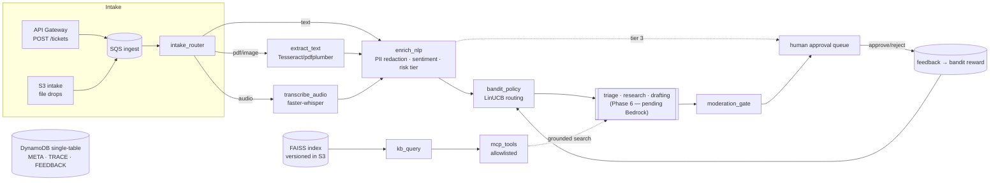
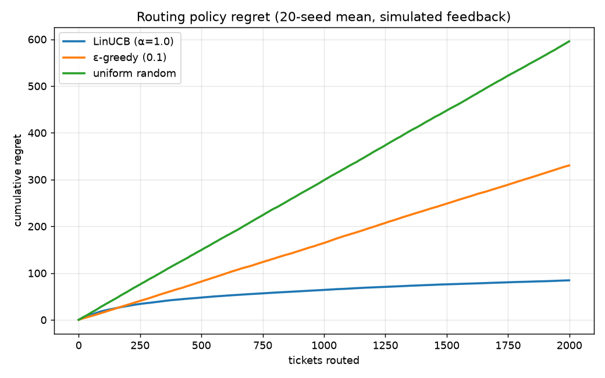
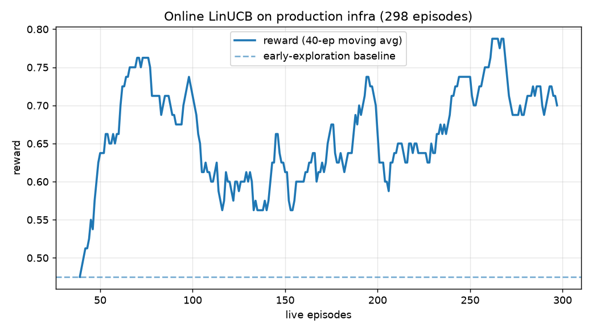

# AEGIS — Agentic Evaluation-Gated Intelligent Support

> AEGIS is a serverless multi-agent platform that ingests support requests in any modality — email
> text, PDF attachments, screenshots, and voice notes — extracts and redacts sensitive information,
> retrieves grounded context from a versioned knowledge base, and drafts cited responses through a
> governed agent pipeline with human approval gates. A contextual-bandit reinforcement-learning
> policy continuously learns the best routing strategy from human feedback, and every deployment is
> gated by an automated evaluation suite that blocks releases if groundedness or retrieval quality
> regresses.

**Status:** 10 of 11 phases live on AWS. The agent layer (Phase 6) is scaffolded and waiting on a
Bedrock quota unblock; everything it plugs into — ingestion, extraction, redaction, RAG, governance,
the routing bandit, and the eval gate — is deployed and verified. See [build log](docs/build-log.md).

## Architecture



Every stage is a Lambda; every message is a typed Pydantic contract; every ticket carries a full
structured trace. Design decisions live in [docs/decisions](docs/decisions/) (ADRs).

## Verified metrics

Every number is emitted by the system or its eval harness and is reproducible (`make eval`,
`make load-test`, the `bandit/` scripts). Nothing here is hand-written.

| Capability | Metric | Value |
|---|---|---|
| **RAG retrieval** | hit@3 / MRR (65 golden pairs) | **0.94 / 0.89** |
| **PII redaction** | precision / recall (50 Canadian-format cases) | **1.00 / 1.00** |
| **Extraction (born-digital)** | field accuracy / p50 latency | **100% / 72 ms** |
| **Extraction (OCR)** | field accuracy / p50 latency | **100% / 1.1 s** |
| **Routing bandit (offline)** | regret reduction vs random (2000×20) | **85.8%** |
| **Routing bandit (online)** | mean reward, first 50 → last 50 episodes | **0.53 → 0.72** |
| **Adversarial defense** | attack cases blocked | **20 / 20** |
| **Ingestion throughput** | 1,000-ticket load, end-to-end p95 / DLQ | **1.37 s / 0** |
| **Cost** | steady-state monthly (always-free + ECR) | **~$0.45** |




## What makes this more than "a RAG chatbot on AWS"

1. **Online reinforcement learning in production** — a LinUCB contextual bandit that learns the
   routing policy from human approve/edit/reject feedback while the system runs, with a real
   cumulative-regret curve. Reward design in [ADR-004](docs/decisions/004-bandit-reward-design.md).
2. **A governance layer, not a disclaimer** — per-agent tool allowlists enforced server-side in the
   MCP server, a moderation gate that re-checks every draft for PII leakage and uncited claims, full
   provenance-tagged trace logging, and a mandatory human gate for high-risk tickets.
3. **Evaluation-gated CI/CD** — every deploy runs a groundedness/retrieval/redaction/adversarial
   regression suite; below threshold, **the pipeline blocks the deploy** (demonstrated live).
4. **Dual-path extraction with a measured verdict** — classical OCR vs. multimodal, benchmarked on
   the same documents through the real pipeline (multimodal column pending Bedrock).
5. **MCP-native tool interface** — agents call tools through a Model Context Protocol server, reusing
   patterns from merged OpenHive MCP PRs (#6963, #6818).
6. **Cost engineering as a feature** — the whole platform runs inside AWS always-free limits at
   steady state; see [cost model](docs/cost-model.md).
7. **Verified metrics only** — every resume-bound number is regenerable by a script.

## Quick start

```bash
make setup         # venv + deps + pre-commit hooks
make test          # ruff + mypy + pytest (29 tests)
make eval          # retrieval/redaction/extraction/adversarial vs thresholds.yaml
make build-index   # rebuild the FAISS index from knowledge/docs
make deploy        # terraform apply (needs AWS creds + bootstrap)
make load-test API=<url> N=1000   # fire synthetic tickets, measure p95
```

Live demo endpoint: `GET /` serves the intake UI (submit any modality, watch the trace timeline,
work the approval queue, search the KB, view the eval scorecard).

## AI-103 syllabus mapping

| AI-103 domain | AEGIS component |
|---|---|
| Plan & manage AI solutions | ADRs, Terraform IaC, model-selection matrix, cost model, per-Lambda least-privilege IAM |
| Generative AI & agentic solutions | Triage/Research/Drafting agents (Phase 6), tool-augmented flows, RAG, MCP tool server |
| Computer vision | Screenshot/scan OCR path; multimodal document understanding (pending Bedrock) |
| Text analysis | Sentiment, language detection, PII detection & redaction, speech-to-text |
| Information extraction | Dual-path OCR-vs-multimodal benchmark, entity extraction, provenance metadata |
| Guardrails / evaluators / auditing | Moderation gate, tool allowlists, trace logs, approval workflow, CI eval harness |

Implemented on AWS (Lambda, Step Functions, Bedrock, DynamoDB, SQS, S3, CloudWatch) rather than Azure;
the objectives map one-to-one.

## Repository layout

`services/` one dir per Lambda · `shared/aegis_core` the only cross-service import (contracts,
tracing, store) · `infra/` modular Terraform · `knowledge/` KB + index scripts · `evals/` golden
sets + harness + thresholds · `bandit/` LinUCB + simulator + notebooks · `docs/` ADRs, governance,
cost model, build log.
